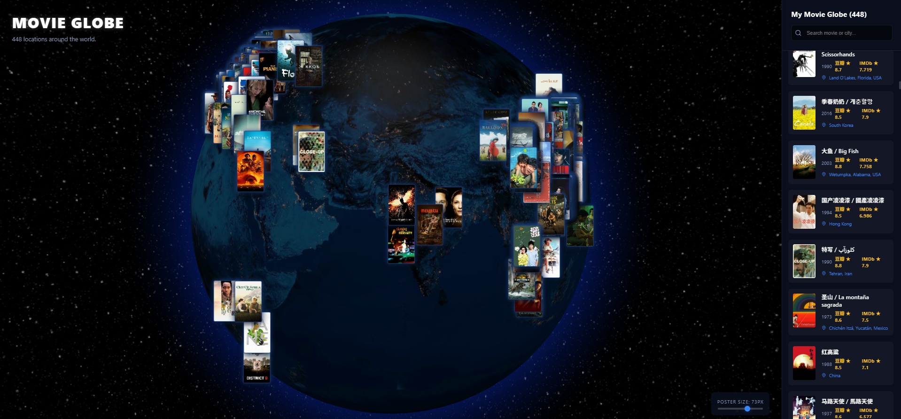

# Movie Globe 🌎🎬

*"Every film leaves a trace somewhere on Earth."*

看电影的时候，我们其实不只是坐在屏幕前。
很多时候，我们是在 **走进一个地方**。

也许是维也纳的一条街、东京的一家居酒屋、
也许是冰岛的荒原，或者重庆的一段扶梯。

看完电影之后，这些地方就会留在脑海里。
有时候在旅行时，我们甚至会突然想起：

> “诶，这是不是那部电影拍过的地方？”

**Movie Globe** 就是从这样一个很简单的想法开始的。

如果把你看过的电影都放在一颗地球上，会是什么样子？

这个项目会读取你在 **豆瓣 (Douban)** 标记为“看过”的电影，
然后自动匹配：

* **TMDB** 的电影海报与评分
* **IMDb** 记录的真实拍摄地

最后把这些信息转成一个 **可以在浏览器里旋转、点击和探索的 3D 地球**。

于是，你的观影历史不再只是一个列表，
而是一张 **跨越世界的电影地图**。

---



---

# 📍 地球上的光点代表什么？

地球上的每一个光点，都来自 **IMDb 的 Filming Locations（取景地）数据库**。

它不是电影上映的国家，也不是制作公司所在的城市。
而是 **剧组真正架起摄影机的地方**。

可能是：

* 《爱在黎明破晓前》里维也纳的那家唱片店
* 《星际穿越》在冰岛拍摄的荒凉海岸
* 《重庆森林》里的半山自动扶梯

每一个光点，都是 **现实世界与电影故事交汇的地方**。

---

# 🚀 Quick Start

这个项目分为两个部分：

1️⃣ **Scraper (Python)**
负责自动抓取你的观影记录并整理数据

2️⃣ **Frontend (React)**
把这些数据渲染成一个可以旋转的 3D 地球

---

# 1️⃣ 准备信息

在开始之前，你需要准备三个东西：

### Douban ID

你的豆瓣主页链接中的数字 ID。

### Douban Cookie

登录 [豆瓣电影](https://movie.douban.com/)，按 `F12` 打开开发者工具，在 **Network** 中找到任意请求，复制 `Request Headers` 里的 `Cookie`。

### TMDB API Key

在 **The Movie Database** 注册账号并申请一个免费的 API Key。

---

# 2️⃣ 一键抓取数据

只需要确保安装了 **Python 3.8+**，然后运行：

```bash
python start.py
```

终端会一步一步引导你输入：

* Douban ID
* Cookie
* TMDB Key
* 本地代理（可选，例如 `http://127.0.0.1:7897`）

之后脚本会自动完成：

1. 创建 `.env` 配置文件
2. 安装所有 Python 依赖
3. 启动多线程爬虫抓取电影数据
4. 获取 IMDb 拍摄地并转换为经纬度
5. 生成 `movies.json`
6. 自动复制到前端目录

整个过程通常只需要几分钟。

---

# 3️⃣ 打开你的电影地球

进入前端目录：

```bash
cd frontend
npm install
npm run dev
```

浏览器打开终端提示的地址（通常是 `http://localhost:5173`）。

现在你可以：

* 用鼠标旋转地球
* 点击光点查看电影
* 从电影中找到新的旅行灵感

---

# 🛠 Tech Stack

**Backend**

* Python
* BeautifulSoup
* ThreadPoolExecutor (多线程爬虫)

**Data**

* IMDb Filming Locations
* OpenStreetMap Nominatim

**Frontend**

* React
* Globe.gl (Three.js)
* Vite

---

Open sourced with ❤️ and 🍿
